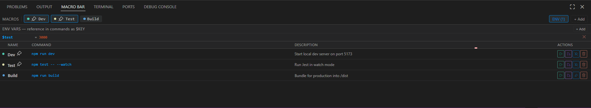

# Lazy Terminal

Stop retyping your most-used terminal commands. Save them as one-click macros, categorize them into groups, wire up env vars, and run commands with custom args — all from a beautiful, responsive panel in VS Code.

---



## Features

### 🚀 Top Quick-Access "Chip Bar"
Get instant access to your macros at the very top of the panel. The horizontal scrollable chip bar features a minimalist design with custom color dots and **real-time usage badges** that show exactly how many times you've run each command.

### 🔍 Instant Client-Side Search
As your macro collection grows, find what you need in milliseconds. The responsive search bar filters down your macros instantly by matching text against the **Name**, the **Command**, or the **Description**.

### 🏷️ Dynamic Grouping & Filters
Organize your workflows into clean categories (e.g., `npm`, `docker`, `git`, `aws`). Clicking on the dynamically generated, color-coded group pills filters your dashboard view immediately.

### ▶ One-Click Macros & Run with Args
* **Standard Run:** Click any macro or chip to execute it instantly in your active terminal session.
* **Run with Args (▶+):** Need to pass a quick flag on the fly? Trigger your macro with custom trailing arguments via an interactive input box.

```
Base command:  npm run dev
Extra args:    --port $PORT --open
Final command: npm run dev --port 3000 --open
```

### 🔐 Multi-Pass Environment Variables
Define global key-value pairs in the toggleable ENV panel and reference them using `$KEY` or `${KEY}` syntax. The extension features a deep recursive resolution system that handles chained variables up to **10 passes deep**.

```
PORT = 3000
HOST = localhost
URL  = $HOST:$PORT        →  resolves to: localhost:3000
CMD  = curl $URL/health   →  resolves to: curl localhost:3000/health
```

### 📋 Copy Resolved Commands
Need to share a command or run it elsewhere? The dedicated copy button expands all environment variables to their actual values and copies the fully resolved command straight to your clipboard with status bar confirmation.

### 📌 Smart Pinning & Sorting
Keep your most critical commands exactly where you need them. Pinned macros float to the top, while unpinned macros automatically self-sort dynamically based on your usage frequency.

### 🤖 Smart Auto-Capture
Lazy Terminal actively listens to your terminal executions. If you run a unique command, a gentle VS Code toast asks if you want to save it as a macro instantly. It features built-in noise filtering to completely ignore everyday commands like `ls`, `cd`, `pwd`, `clear`, `exit`, etc.

### 🛠️ Interactive Configuration Wizards
No messy configuration files to edit. Adding or editing macros triggers a clean, multi-step interactive walkthrough right inside VS Code to help you configure labels, shell scripts, descriptions, and group assignments seamlessly.

---

## Usage

The **Lazy Terminal** panel lives in your sidebar or panel area (registering the `terminalMacroBarView` view container).

### Interface Controls

| Icon / Action | Description |
|:---:|---|
| **▶** | Run macro in active or new terminal |
| **▶+** | Prompt for extra flags/arguments to append on execution |
| **📋** | Copy fully resolved command (with expanded ENV vars) to clipboard |
| **✏️** | Open the 4-step wizard to edit Label, Command, Description, and Group |
| **📌** | Toggle pin status (floats macro to the top of your list) |
| **🗑️** | Delete macro (requires explicit modal confirmation) |
| **ENV** | Toggle the collapsible environment variables panel |
| **+ Add** | Open the step-by-step wizard to create a macro manually |

---

## Requirements

- VS Code `^1.84.0`
- Shell integration enabled in your VS Code settings (enabled by default) for the terminal auto-capture feature.

---

## Extension Settings

No manual configurations or JSON management required. All macros, groups, tracking metrics, and environment variables are safely managed inside VS Code's `globalState` and persist securely across your developer workspace sessions.

---

## Release Notes

### 0.1.0
* **New UI Framework:** Revamped the panel using a responsive Webview layout with color-coded dot matrixes and fluid row actions.
* **Quick Access Chips:** Added a top-level macro chip bar with dynamic execution counter badges.
* **Instant Filtering:** Added full-text search alongside interactive, dynamic group tag pills.
* **Copy Resolved Syntax:** Implemented clipboard integration that pre-resolves multi-pass environment configurations before copying.
* **Interactive Wizards:** Built multi-step quick-pick and input systems for fluid creation and editing.
* **Smart Shell Filter:** Seeded auto-capture with a robust `NOISY_CMDS` lookup table to keep noise out of your dashboard.

### 0.0.5
* Initial release — core macros, env vars with recursive resolution, run-with-args, pinning, and basic auto-capture.
